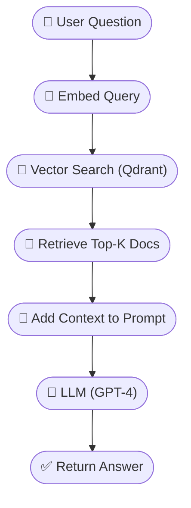

# 📝 Week [2] — [Vector Search]

> 📅 Date: [Insert date]  
> 🔍 Topic: [LLMs / Vector Search / RAG / etc.]  
> 🎯 Goal: [What was this week’s goal or assignment?]  
Learn about Vector Data bases aand how its works

---

## ✅ Key Concepts

- 🔹 **Concept 1**: RAG System - Q&A System  
- 🔹 **Concept 2**: Embedding  
- 🔹 **Concept 3**: Vector Search (Qdrant)  

> ✨ _Use bullet points to highlight insights or aha moments._

---

## 📈 RAG Pipeline – Dataflow Diagram


---


## 💬 Reflection 

> ❓ **Qdrant will be part of a RAG system, Do I need splitting/chunking, or does Qdrant handle that for me?**


### ✅ So… Does Qdrant Create the Semantic Vectors?

> ❌ **No, Qdrant does not embed or chunk your data.**

Qdrant is a **storage and search engine for vectors** — it expects **you to provide the vectors**, and optionally some metadata (like the original text, tags, document ID, etc.).

You are still responsible for:

1. 🔹 **Splitting the input text into chunks**
2. 🔹 **Embedding each chunk** using a model (e.g. OpenAI, HuggingFace,  FastEmbed as our embedding provider)
3. 🔹 **Sending each vector into Qdrant as a point**

Only then Qdrant can perform **semantic search**.

---

### 🧩 Why is Splitting/Chunking Important?

- LLMs and embedding models have token limits (e.g. 512–2048 tokens).
- Embedding an entire book or long document often loses **semantic precision**.
- Chunking enables you to **preserve context boundaries**, such as paragraphs or topics.
- Smaller chunks → more precise matches → better answers from the LLM.

---

### 📦 What Qdrant Actually Handles

- Fast nearest-neighbor search in vector space (HNSW, filtering, etc.)
- Metadata filtering (e.g. search only inside `type="faq"` documents)
- Storing IDs, payloads, and versions of your documents
- Optional vector compression or quantization (advanced use)

---

### 🔁 Typical Flow with Qdrant in a RAG System

```text
[Document Text]
    ↓  (Chunking)
[Chunks of 200–500 words]
    ↓  (Embedding - FastEmbed)
[Vector Representations]
    ↓  (Store in Qdrant)
[Qdrant Collection: Vectors + Payloads]
    ↓  (User Query → Embed)
[Vector Search → Top-k Chunks]
    ↓
[LLM Prompt (Query + Context)]
    ↓
[Generated Answer]
```

---

## ✅ Summary Takeaway

> Qdrant **is a powerful semantic search engine**, but **you still need to do the chunking and embedding** before inserting your data. It doesn’t replace that step — it enables it at scale.---
> FastEmbed **is an optimized embedding solution** designed specifically for **Qdrant**
> Like most dense embedding models, **jina-embedding-small-en was trained to measure semantic closeness** using **cosine similarity**.
You can find this information, for example, on the model’s [Hugging Face card.](https://huggingface.co/jinaai/jina-embeddings-v2-small-en)
> The best way to **select an embedding model is to test and benchmark** different options on your **own data**.

---

## 📚 Resources & References

- [Qdrant is an open-source: vector search engine](https://qdrant.tech/articles/dedicated-vector-search/)
- [FastEmbed Embeddings](https://github.com/qdrant/fastembed)
- [ChromaDB GitHub](https://github.com/chroma-core/chroma)
- [Hugging Face card](https://huggingface.co/jinaai/jina-embeddings-v2-small-en)

